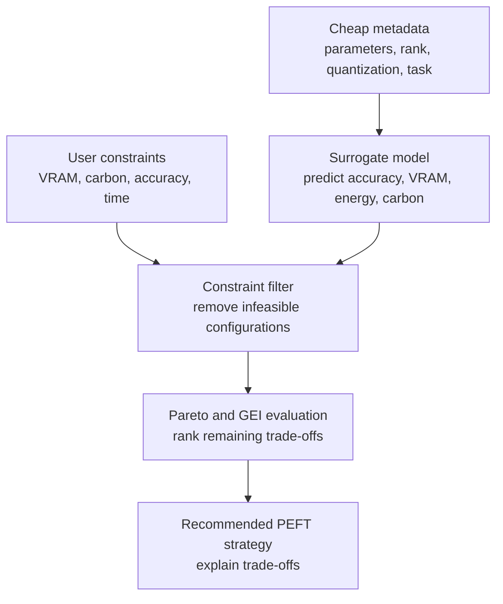

# GreenPEFT Development Context

## 1. Purpose

GreenPEFT is a benchmark and decision-support pipeline for selecting parameter-efficient fine-tuning (PEFT) strategies under competing accuracy, memory, time, energy, and carbon constraints.

The immediate development goal is to turn the current measured benchmark into a reproducible recommendation system. The benchmark and scoring stages exist today. The predictive surrogate, constraint-query interface, and recommendation explanation layer remain the main implementation work.

## 2. Current Pipeline



### Implemented stages

1. **Configuration:** Backbone, task, and method definitions are stored in `results/canonical_benchmark/configs/`.
2. **Measured execution:** The notebook records per-run status, model metadata, seed, GPU, training budget, peak memory, wall-clock time, energy, carbon, and errors.
3. **Aggregation:** Successful runs are grouped by method, backbone, task, and seed statistics.
4. **Scoring:** Accuracy, memory, energy, carbon, time, GEI, and alternative score profiles are computed.
5. **Pareto extraction:** Non-dominated feasible configurations are exported to `pareto_fronts.csv`.

### Not yet implemented as a complete product

- Calibrated uncertainty estimates for CLI predictions.
- Automatic recommendation explanations tied to active constraints.
- Cross-task and cross-hardware validation.

The initial constraint-query CLI is now implemented in `green_peft_cli/green_peft_pkg/`.

## 3. Evidence Base

The canonical evidence bundle is [results/canonical_benchmark](results/canonical_benchmark). The source notebook is [Green_PEFT.ipynb](Green_PEFT.ipynb).

The manifest reports:

- **Platform:** Kaggle, NVIDIA Tesla T4.
- **GPU memory:** approximately 15.6 GB reported by the raw runs.
- **Task:** SST-2 classification with accuracy as the evaluation metric.
- **Backbones:** Qwen2.5-0.5B, TinyLlama-1.1B, Qwen2.5-1.5B, and Qwen2.5-3B.
- **Methods:** Full Fine-Tuning, LoRA, QLoRA, LoRA-FA, and LISA.
- **Seeds:** 13, 42, and 2024.
- **Training budget:** 300 steps, batch size 8, gradient accumulation 2, maximum sequence length 128.
- **Carbon factor:** 0.65 kgCO2e per kWh.
- **Raw records:** 60.

### Run status

The raw directory contains **41 successful runs** and **19 OOM records**. OOM records are retained as resource-feasibility observations and must not be silently dropped from feasibility analysis. The aggregate files contain 14 feasible method/backbone combinations; failed runs do not have valid performance and environmental means.

This corrects the earlier pilot description that reported 12 successful runs. Future reports should derive status counts directly from the raw JSON records or manifest rather than relying on copied narrative text.

### Surrogate and CLI Export

The first reusable surrogate export is available at
`surrogate_artifacts_export/artifacts_export/`:

```text
artifacts_export/
├── configs/
│   ├── backbones.yaml
│   ├── methods/*.yaml
│   └── tasks.yaml
└── results/
    ├── surrogate_models.joblib
    ├── surrogate_cv_metrics.json
    └── surrogate_dataset.csv
```

After `python -m pip install -e .` from `green_peft_cli/green_peft_pkg/`, query it with:

```bash
green-peft recommend \
  --artifacts-dir ./surrogate_artifacts_export/artifacts_export \
  --vram 16 --accuracy 0.90 --profile balanced --json
```

The exported catalog contains the four benchmarked tiers plus additional 135M, 360M,
600M, 1.7B, 2.7B, 3.8B, and approximately 7B parameter entries. Recommendations for
unbenchmarked entries are extrapolations and require experimental validation.

The recorded leave-one-tier-out validation reports feasibility accuracy of **0.7833**.
Regression MAE / R² are **0.0182 / -0.4573** for accuracy, **3.9703 GB / -0.5154**
for peak VRAM, **0.000563 kWh / 0.3740** for energy, and **33.12 seconds / 0.4077**
for wall-clock time. The CLI is therefore appropriate for shortlisting, budget checks,
and experiment planning, but not unattended production decisions.

## 4. Empirical Findings

The current aggregate table covers 14 feasible configurations with the following observed ranges:

- Accuracy mean: **0.8868 to 0.9484**.
- Peak memory mean: **3.071 to 15.517 GB**.
- Energy and carbon generally increase with model size, but method choice changes the trade-off substantially.
- Results are based on one task, one GPU class, one training budget, and only three seeds. They are useful for method comparison on this setup, not yet for universal claims.

Representative observations from `aggregated.csv`:

| Configuration | Accuracy | Peak memory | Energy | Carbon |
| --- | ---: | ---: | ---: | ---: |
| QLoRA + 3B | 0.9484 | 7.452 GB | 0.006014 kWh | 0.003909 kgCO2e |
| LoRA + 1.5B | 0.9478 | 12.278 GB | 0.002180 kWh | 0.001417 kgCO2e |
| LoRA + 1.1B | 0.9438 | 9.736 GB | 0.001774 kWh | 0.001153 kgCO2e |
| QLoRA + 1.5B | 0.9434 | 6.776 GB | 0.003436 kWh | 0.002233 kgCO2e |
| LoRA + 0.5B | 0.9174 | 4.654 GB | 0.001222 kWh | 0.000794 kgCO2e |
| QLoRA + 0.5B | 0.9117 | 3.071 GB | 0.002147 kWh | 0.001396 kgCO2e |

These observations support a decision engine rather than a single global winner:

- **Highest measured accuracy:** QLoRA with the 3B backbone, but with higher energy, carbon, and wall-clock cost.
- **Strong accuracy-efficiency balance:** LoRA with the 1.5B backbone.
- **Lowest measured memory:** QLoRA with the 0.5B backbone.
- **Lowest measured carbon among feasible configurations:** LoRA with the 0.5B backbone.
- **Full fine-tuning:** The 0.5B configuration is feasible, while larger full fine-tuning configurations generate OOM records on the T4.
- **LISA:** Feasible at several sizes, but its accuracy and memory behavior justify a dedicated hyperparameter ablation before making broad claims about it.

## 5. Scoring and Decision Semantics

The current bundle includes balanced, accuracy-first, and carbon-constrained scores. The manifest records GEI weights:

$$
\mathrm{GEI}(c) = 0.40\,S_{\mathrm{accuracy}} + 0.25\,S_{\mathrm{memory}} + 0.20\,S_{\mathrm{carbon}} + 0.15\,S_{\mathrm{time}}
$$

The implementation normalizes metrics within the evaluated candidate set. This means a GEI score is relative to the benchmark slice used to compute it. It should not be presented as an absolute environmental or quality rating across hardware, tasks, or datasets.

The future decision function should apply constraints before scoring:

1. Reject configurations whose predicted or measured peak VRAM exceeds the user budget.
2. Reject configurations above the carbon or time budget.
3. Reject configurations below the minimum accuracy floor.
4. Compute the Pareto frontier among the surviving configurations.
5. Rank the frontier using the selected preference profile.
6. Return the recommendation together with rejected alternatives and the binding constraints.

## 6. Surrogate Model Design

The planned surrogate should predict each target separately or through a validated multi-output model:

- Accuracy.
- Peak VRAM.
- Wall-clock time.
- Energy.
- Carbon.

Candidate input features should include:

- Backbone parameter count and model family.
- Method identifier.
- Adapter rank and alpha where applicable.
- Quantization bits and quantization type.
- Trainable parameter percentage.
- Task identifier and dataset size.
- Sequence length, batch size, gradient accumulation, and training steps.
- GPU class and available VRAM.

Recommended first implementation:

1. Build a leakage-safe feature table from raw runs and configuration YAML.
2. Split by configuration family or backbone, not only by random row, so the test set measures extrapolation.
3. Establish a mean or linear baseline.
4. Compare Random Forest or Gradient Boosting with XGBoost if available.
5. Report MAE, RMSE, and $R^2$ for every target, plus calibration or prediction intervals.
6. Keep OOM as a separate feasibility classifier or censored outcome. Do not impute a normal metric value for an OOM run.
7. Persist the feature schema, model version, training split, and environment metadata beside the model artifact.

The surrogate is only useful for recommendation if its errors are incorporated into decisions. A conservative first policy is to reject a candidate when its upper confidence bound exceeds a VRAM, carbon, or time cap, and to require the lower confidence bound to meet the accuracy floor.

## 7. Development Roadmap

### Phase 1: Reproducible benchmark foundation

- [ ] Add a machine-readable run-summary validator.
- [ ] Recompute status counts and feasible configuration counts from raw JSON.
- [ ] Add deterministic configuration and environment fingerprints.
- [ ] Separate measured, simulated, failed, and inferred records in every export.
- [ ] Add tests for aggregation, normalization, Pareto dominance, and GEI calculation.
- [ ] Document the exact CodeCarbon and CUDA measurement assumptions.

### Phase 2: Predictive decision engine

- [ ] Create the feature-table builder from YAML plus raw JSON.
- [ ] Implement baseline and tree-based surrogate models.
- [ ] Add OOM/feasibility classification.
- [ ] Add uncertainty-aware constraint filtering.
- [ ] Implement a recommendation function with structured output:
  `recommendation`, `feasible_candidates`, `rejected_candidates`, `binding_constraints`, and `confidence`.
- [ ] Add scenario tests for 8, 16, 24, and 48 GB VRAM budgets, multiple carbon caps, and accuracy floors.

### Phase 3: External validity and research contribution

- [ ] Repeat the benchmark on additional GPU classes.
- [ ] Add summarization and instruction-following tasks.
- [ ] Add DoRA and/or GaLore with matched training budgets.
- [ ] Run LISA hyperparameter ablations, especially sampling probability and resampling interval.
- [ ] Replace provisional GEI weights with a documented AHP process or a sensitivity analysis.
- [ ] Evaluate recommendation stability under seed, hardware, and weight perturbations.
- [ ] Compare the engine explicitly with related constraint-aware PEFT and green-AI systems.

### Phase 4: Usable tooling

- [x] Package the recommendation path as a CLI, for example:
  `green-peft recommend --vram 16 --carbon 0.05 --accuracy 0.85`.
- [x] Export JSON decision reports.
- [ ] Export CSV decision reports.
- [ ] Provide a reproducible environment file and a small local smoke-test mode.
- [ ] Add a visualization of the feasible set, Pareto frontier, and recommended point.

### Professional Operating Procedure

1. Record the task, dataset size, hardware, accuracy floor, VRAM cap, carbon cap, and
  time limit before querying the CLI.
2. Save the JSON recommendation together with the artifact export and CLI version.
3. Run the recommended configuration and measure actual accuracy, peak VRAM, energy,
  carbon, and time.
4. Compare predicted and measured values; large errors indicate that the surrogate
  needs new training data.
5. Retrain and revalidate after adding new hardware, tasks, methods, or training
  budgets.

## 8. Research Questions

1. How much accuracy, memory, energy, and carbon can be saved by selecting PEFT methods under explicit resource constraints?
2. Does a metadata-only surrogate predict feasible strategies accurately enough to avoid unnecessary benchmark runs?
3. How stable are recommendations under different GEI weights, seeds, hardware classes, and task distributions?
4. Can OOM outcomes be predicted early enough to improve experiment planning?
5. Does the recommendation policy generalize from SST-2 and a Tesla T4 to other tasks and accelerators?

## 9. Reporting Rules

Future analysis should follow these rules:

- Distinguish raw attempts from successful aggregates.
- Report OOM and dependency failures separately from valid metric values.
- Include the number of seeds for every aggregate row.
- Report means and standard deviations, not only the best seed.
- Keep carbon intensity and hardware details beside carbon results.
- Avoid claiming general superiority from the current single-task, single-GPU evidence.
- Treat GEI as a preference-dependent ranking, not a ground-truth measure.
- Record changes to method hyperparameters, especially LISA sampling and resampling settings.

## 10. Primary Files

- [Green_PEFT.ipynb](Green_PEFT.ipynb): current benchmark workflow.
- [results/README.md](results/README.md): results navigation guide.
- [results/canonical_benchmark/manifest.json](results/canonical_benchmark/manifest.json): experiment metadata.
- [results/canonical_benchmark/raw_runs](results/canonical_benchmark/raw_runs): per-run records, including OOM outcomes.
- [results/canonical_benchmark/metrics/aggregated.csv](results/canonical_benchmark/metrics/aggregated.csv): feasible aggregate measurements.
- [results/canonical_benchmark/metrics/aggregated_scored.csv](results/canonical_benchmark/metrics/aggregated_scored.csv): alternative score profiles.
- [results/canonical_benchmark/metrics/aggregated_gei.csv](results/canonical_benchmark/metrics/aggregated_gei.csv): GEI-scored results.
- [results/canonical_benchmark/metrics/pareto_fronts.csv](results/canonical_benchmark/metrics/pareto_fronts.csv): Pareto candidates.
- [results/canonical_benchmark/configs](results/canonical_benchmark/configs): benchmark configuration source.
