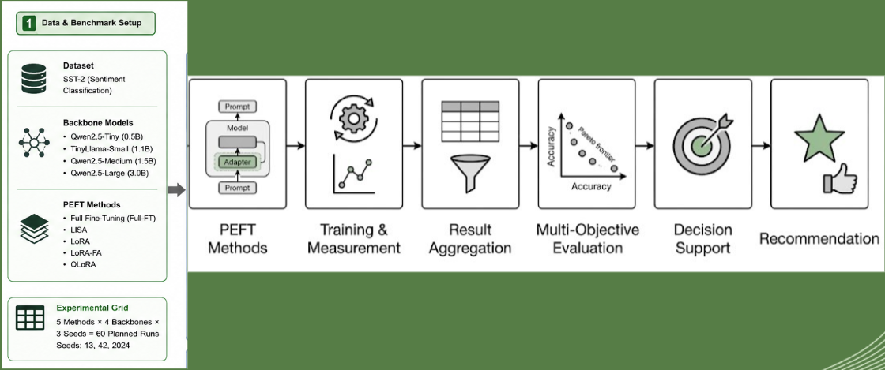
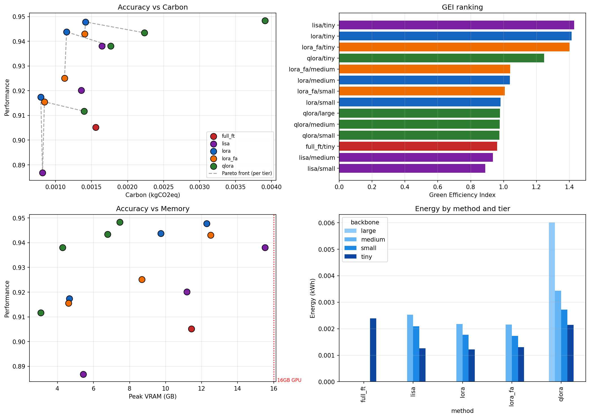

# GreenPEFT: A Multi-Objective Green AI Decision Support Framework

> **Sustainable Parameter-Efficient Fine-Tuning of Large Language Models via Predictive Zero-Shot Constraint Filtering and Green Efficiency Index (GEI)**


[](https://www.python.org/)
[](https://pytorch.org/)
[](https://codecarbon.io/)

---

## 📌 Executive Summary

**GreenPEFT** shifts the paradigm of sustainable machine learning from static post-hoc benchmarking (*"Which method was most energy-efficient in past runs?"*) to **predictive, constraint-aware decision support** (*"Which PEFT configuration dynamically satisfies user VRAM, carbon, energy, and accuracy constraints while maximizing resource efficiency?"*).

Instead of requiring practitioners to run expensive empirical sweeps prior to selecting a fine-tuning strategy, GreenPEFT leverages a **zero-shot surrogate regressor** trained on pre-training metadata features (backbone parameters, adapter rank, quantization bits, dataset size) to forecast task performance and environmental cost. Combined with a multi-objective decision engine, Pareto-frontier filtering, and the **Green Efficiency Index (GEI)**, GreenPEFT prescribes the optimal adaptation strategy in sub-second inference time.

---

## 📑 Core Documentation & Repository Artifacts

| Document / Artifact | File Link | Description & Purpose |
| :--- | :--- | :--- |
| **Benchmark notebook** | [Green_PEFT.ipynb](Green_PEFT.ipynb) | End-to-end notebook for the GreenPEFT benchmark. |
| **Benchmark log** | [Green_PEFT_log.txt](Green_PEFT_log.txt) | Execution log from the benchmark run. |
| **Methodology diagram** | [methodology.png](methodology.png) | Overview of the GreenPEFT pipeline. |
| **Results index** | [results/README.md](results/README.md) | Navigation guide for canonical results, working files, archives, and notebook assets. |
| **Canonical benchmark** | [results/canonical_benchmark](results/canonical_benchmark) | Configurations, raw runs, aggregate metrics, Pareto fronts, and figures from the 60-run Kaggle T4 benchmark. |
| **Working run** | [results/working_run](results/working_run) | Working data, duplicate exports, and the original benchmark archive. |
| **Surrogate export** | [model/artifacts_export](model/artifacts_export) | Exported surrogate models, validation metrics, feature data, and candidate configuration files used by the CLI recommender. |
| **Surrogate dataset** | [GreenPEFT Surrogate Data on Kaggle](https://www.kaggle.com/datasets/ashrafulislamtanzil/greenpeft-surrogate-data) | Benchmark-derived features and targets used to train the surrogate models. |
| **CLI package** | [green_peft_cli/green_peft_pkg](green_peft_cli/green_peft_pkg) | Installable `green-peft` command for constraint-aware experiment planning. |
| **Hugging Face model** | [ai-tanzil/GreenPEFT](https://huggingface.co/ai-tanzil/GreenPEFT) | Published surrogate artifacts and model card. |

---

## 🏗️ Framework Architecture & Pipeline Workflow




## 🔬 Core Research Questions (RQs)

- **RQ1 (Sustainability Benchmarking):** How do Full Fine-Tuning (Full-FT), LoRA, QLoRA, LoRA-FA, and LISA compare across accuracy, peak VRAM, wall-clock time, energy draw (kWh), carbon emissions ($\text{kgCO}_2\text{eq}$), and monetary cost?
- **RQ2 (Multi-Objective Trade-offs):** Which PEFT configurations construct the non-dominated Pareto frontier when accuracy is jointly traded off against memory and environmental footprint?
- **RQ3 (Constraint-Aware Decision Support):** Can a constraint engine reliably prescribe optimal strategies given explicit hardware and carbon budgets?
- **RQ4 (Predictive Recommendation — Core Novelty):** Can a lightweight surrogate regressor accurately estimate performance metrics from cheap pre-training metadata, enabling zero-shot strategy selection?

---

## 📊 Empirical Kaggle Pilot Benchmark (NVIDIA Tesla T4)



Below are the empirical findings from a 60-run benchmark grid executed on Kaggle using an **NVIDIA Tesla T4 GPU (16 GB VRAM)** on the SST-2 classification task ($k=3$ random seeds):

| Strategy | Backbone | Params | Accuracy (mean ± std) | Wall-clock (s) | Peak VRAM (GB) | Energy (kWh) | Carbon (kgCO₂eq) | GEI Score |
| :--- | :--- | :---: | :---: | :---: | :---: | :---: | :---: | :---: |
| **full_ft** | Qwen2.5-Tiny | 0.5B | **0.9122 ± 0.0117** | 222.77 | 13.48 | 0.00382 | 0.00248 | 0.964 |
| **lisa** | Qwen2.5-Tiny | 0.5B | 0.5089 ± 0.0165 | **182.87** | **4.84** | **0.00324** | **0.00211** | **0.999** |
| **lisa** | TinyLlama-Small | 1.1B | 0.6122 ± 0.0901 | 467.91 | 9.43 | 0.00833 | 0.00541 | 0.822 |
| **lisa** | Qwen2.5-Medium | 1.5B | 0.4889 ± 0.0342 | 636.33 | 14.88 | 0.01124 | 0.00731 | 0.751 |

### Key Takeaways from Pilot Runs:
1. **Full-FT Memory Ceiling:** Full Fine-Tuning hits a hard VRAM wall at 0.5B parameters ($13.48$ GB peak VRAM). At $\ge 1.1\text{B}$, Full-FT immediately fails with Out-Of-Memory (OOM) errors.
2. **LISA Hardware Scaling:** LISA enables a 1.5B model to execute within a 16 GB VRAM budget ($14.88$ GB peak), where Full-FT fails completely.
3. **GEI Dominance:** LISA on 0.5B achieves the highest GEI score ($0.999$) due to its compact $4.84$ GB memory footprint and low carbon footprint.

---

## 🛠️ Repository Structure

```text
├── Green_PEFT.ipynb                    # Master benchmark notebook
├── Green_PEFT_log.txt                  # Benchmark execution log
├── methodology.png                     # Pipeline diagram
├── results/
│   ├── README.md                       # Results navigation guide
│   ├── canonical_benchmark/            # Verified benchmark source of truth
│   │   ├── configs/                    # Backbone, task, and method YAML files
│   │   ├── raw_runs/                   # Individual JSON run logs (60 files)
│   │   ├── figures/                    # Benchmark visualizations
│   │   ├── metrics/                    # Aggregate, scored, Pareto, and sweep CSVs
│   │   └── manifest.json               # Bundle metadata
│   ├── working_run/                    # Working data and retained exports
│   ├── notebook_assets/                # Notebook-rendered support files
│   └── cache/                          # Download/cache metadata
└── readme.md                           # Project documentation
```

---

## 🚀 Environment Setup & Installation

### 1. Prerequisites
- Python 3.10+
- PyTorch 2.2+ with CUDA support
- GPU with CUDA capabilities (tested on NVIDIA Tesla T4 16GB)

### 2. Install Dependencies & Fix Environment Conflicts
To prevent dependency locks encountered during initial benchmark sweeps (`torchao` version mismatch and `bitsandbytes` quantization requirements), install updated packages:

```bash
pip install torch torchvision torchaudio --index-url https://download.pytorch.org/whl/cu121
pip install --upgrade "peft>=0.10.0" "bitsandbytes>=0.46.1" "torchao>=0.16.0" codecarbon transformers datasets accelerate trl pandas numpy scikit-learn
```

### 3. Install the recommendation CLI

The CLI does not require PyTorch or a GPU. Install the published package in a
separate environment:

```bash
python -m pip install green-peft
```

Published release:

- [PyPI: green-peft 0.1.0](https://pypi.org/project/green-peft/0.1.0/)
- [Hugging Face: ai-tanzil/GreenPEFT](https://huggingface.co/ai-tanzil/GreenPEFT)
- [Kaggle: GreenPEFT Surrogate Data](https://www.kaggle.com/datasets/ashrafulislamtanzil/greenpeft-surrogate-data)
- [DOI: 10.57967/hf/10504](https://doi.org/10.57967/hf/10504)

Download the versioned surrogate artifacts:

```bash
git clone https://huggingface.co/ai-tanzil/GreenPEFT
```

Run the recommender:

```bash
green-peft recommend \
    --artifacts-dir ./GreenPEFT \
    --vram 16 --accuracy 0.90 --profile balanced
```

For reproducibility, use the same artifact revision documented by the DOI and
retain the CLI version with every recommendation report.

---

## 🎯 Onboarding & Usage Workflow

The result folders and their intended uses are documented in the [results index](results/README.md). The canonical benchmark is described by its [manifest](results/canonical_benchmark/manifest.json).

### Quick Start (Kaggle T4 Setup):
1. **Upload Notebook:** Import `Green_PEFT.ipynb` into Kaggle.
2. **Set Accelerator:** Select **GPU T4 x2** in the right panel settings.
3. **Execute Cells:**
   - **Cell 1–2:** Verify dependency upgrades and select `RUN_MODE` (`smoke` first, then `real`).
   - **Cell 10:** Launch the CodeCarbon-tracked benchmark sweep.
   - **Cell 13–15:** Extract Pareto frontiers, calculate GEI scores, and run the GreenPEFT Decision Engine.

### CLI Recommendation Workflow

The repository includes a current surrogate export at
`model/artifacts_export`. It contains models trained from the
benchmark traces, the expanded model catalog in `configs/backbones.yaml`, method
configurations, and `results/surrogate_cv_metrics.json`.

List the candidate model and method combinations:

```bash
green-peft list-zoo \
    --artifacts-dir ./model/artifacts_export
```

Request a balanced recommendation under explicit resource constraints:

```bash
green-peft recommend \
    --artifacts-dir ./model/artifacts_export \
    --vram 16 --accuracy 0.90 --profile balanced --top-k 5
```

For automation, request JSON output and select a carbon-constrained profile:

```bash
green-peft recommend \
    --artifacts-dir ./model/artifacts_export \
    --vram 16 --carbon 0.003 --accuracy 0.90 \
    --profile strict_carbon --json
```

The CLI predicts accuracy, peak VRAM, energy, carbon, and wall-clock time, filters
infeasible candidates, then ranks the survivors using Pareto filtering and GEI. It is
a planning aid: always validate the selected configuration with a measured run before
using it as a production policy.

The published CLI release is `green-peft==0.1.0` and the published artifact bundle
is `ai-tanzil/GreenPEFT`. The CLI and artifact bundle should be treated as a matched
release pair.

### Current Surrogate Validation

The exported models use leave-one-tier-out validation across four backbone tiers.
The recorded feasibility accuracy is **0.7833**. Regression MAE and the selected model
for each target are:

| Target | Selected model | MAE | Leave-one-tier-out R² |
| :--- | :--- | ---: | ---: |
| Accuracy | Gradient boosting | 0.0182 | -0.4573 |
| Peak VRAM (GB) | Gradient boosting | 3.9703 | -0.5154 |
| Energy (kWh) | Ridge | 0.000563 | 0.3740 |
| Wall-clock time (s) | Gradient boosting | 33.12 | 0.4077 |

These results support shortlist generation and experiment planning, but not automatic
production approval. Predictions for catalog entries that were not directly benchmarked
are extrapolations. The current evidence base is primarily SST-2 classification on a
Tesla T4, with 41 successful runs and 19 OOM records across 60 attempts.

---

## ⚖️ Green Efficiency Index (GEI) Formula

The **Green Efficiency Index (GEI)** synthesizes multi-dimensional objectives into a single decision score:

$$\text{GEI}(\mathbf{c}) = w_{\text{Acc}} \hat{S}_{\text{Acc}} + w_{\text{Mem}} \hat{S}_{\text{Mem}} + w_{C} \hat{S}_{C} + w_{T} \hat{S}_{T}$$

Where normalized metric scores are defined as:
$$\hat{S}_{\text{Acc}} = \frac{\text{Acc} - \text{Acc}_{\min}}{\text{Acc}_{\max} - \text{Acc}_{\min}}, \quad \hat{S}_{M} = 1 - \frac{M - M_{\min}}{M_{\max} - M_{\min}} \quad (M \in \{\text{Mem}, C, T\})$$

Weights satisfy $\sum w_i = 1$ based on user preference profiles:
- **Balanced Profile:** $w = [0.35, 0.25, 0.25, 0.15]$
- **Strict Carbon Profile:** $w = [0.20, 0.20, 0.50, 0.10]$
- **High-Accuracy Profile:** $w = [0.60, 0.15, 0.15, 0.10]$

---

## 🗺️ Strategic Roadmap (Tiers 1–3)

- [x] **Tier 1 — Core Methodology:** Establish CodeCarbon tracking, run empirical Kaggle pilot, identify OOM boundaries, fix LISA hyperparameter configs (`layer_sample_prob=0.5`).
- [x] **Tier 2 — Analytical Upgrades (initial):** Train and export surrogate regressors on empirical traces. DoRA/GaLore integration and AHP weight derivation remain open.
- [x] **Tier 3 — Systems Tooling (initial):** Package the open-source CLI tool (`green-peft recommend --vram 16 --carbon 0.05`) and export reusable surrogate artifacts. Cross-hardware transfer and production hardening remain open.

---

## 📜 Citation

If you use **GreenPEFT** in your research, please cite the archived Hugging Face
revision [f21ab54](https://huggingface.co/ai-tanzil/GreenPEFT/tree/f21ab54):

[DOI: 10.57967/hf/10504](https://doi.org/10.57967/hf/10504)

```bibtex
@misc{ashraful_islam_tanzil_2026,
    author       = {Ashraful Islam Tanzil},
    title        = {GreenPEFT (Revision f21ab54)},
    year         = {2026},
    url          = {https://huggingface.co/ai-tanzil/GreenPEFT},
    doi          = {10.57967/hf/10504},
    publisher    = {Hugging Face}
}
```
