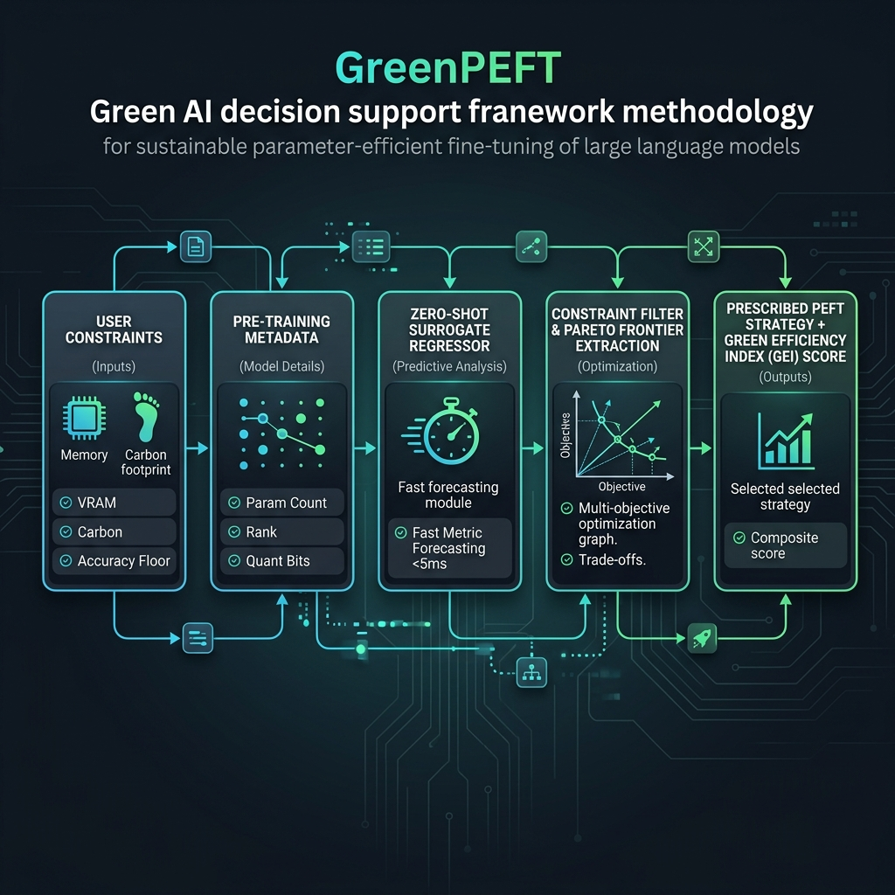
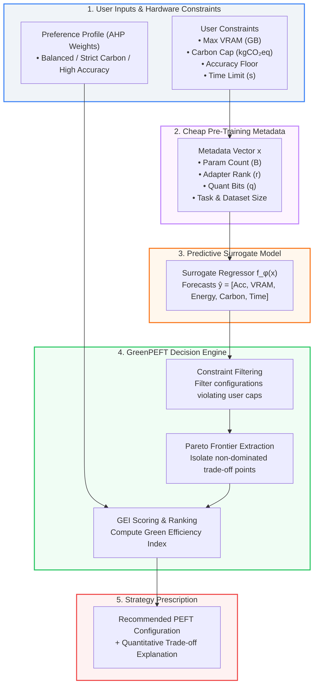
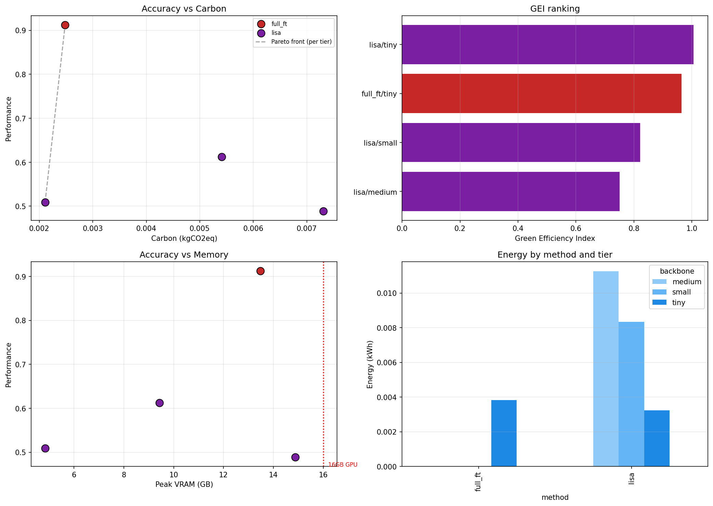

# GreenPEFT: A Multi-Objective Green AI Decision Support Framework

> **Sustainable Parameter-Efficient Fine-Tuning of Large Language Models via Predictive Zero-Shot Constraint Filtering and Green Efficiency Index (GEI)**

[](LICENSE)
[](https://www.python.org/)
[](https://pytorch.org/)
[](https://codecarbon.io/)

---

## 📌 Executive Summary

**GreenPEFT** shifts the paradigm of sustainable machine learning from static post-hoc benchmarking (*"Which method was most energy-efficient in past runs?"*) to **predictive, constraint-aware decision support** (*"Which PEFT configuration dynamically satisfies user VRAM, carbon, energy, and accuracy constraints while maximizing resource efficiency?"*).

Instead of requiring practitioners to run expensive empirical sweeps prior to selecting a fine-tuning strategy, GreenPEFT leverages a **zero-shot surrogate regressor** trained on pre-training metadata features (backbone parameters, adapter rank, quantization bits, dataset size) to forecast task performance and environmental cost. Combined with a multi-objective decision engine, Pareto-frontier filtering, and the **Green Efficiency Index (GEI)**, GreenPEFT prescribes the optimal adaptation strategy in sub-second inference time.

---

## 📑 Core Documentation & Repository Artifacts

| Document / Artifact | File Link | Description & Purpose |
| :--- | :--- | :--- |
| **IEEE Research Paper** | [main.tex](file:///c:/Users/Tanzil/Downloads/green/main.tex) / [GreenPEFT_IEEE.tex](file:///c:/Users/Tanzil/Downloads/green/GreenPEFT_IEEE.tex) | Complete academic manuscript in IEEE format with TikZ system architecture diagram, equations, empirical tables, and references. |
| **Emergency Viva Handout** | [viva_handout.md](file:///c:/Users/Tanzil/Downloads/green/viva_handout.md) | Printable 1-page defense summary, opening script, empirical results table, supervisor Q&A, and math cheat sheet for tomorrow's defense. |
| **Viva & Defense Guide** | [viva_prep.md](file:///c:/Users/Tanzil/Downloads/green/viva_prep.md) | Complete viva preparation handbook with elevator pitches, basic knowledge Q&A, tough supervisor defense questions, and cheat sheet. |
| **Onboarding & Workflow Guide** | [GreenPEFT_Onboarding_and_Workflow.md](file:///c:/Users/Tanzil/Downloads/green/GreenPEFT_Onboarding_and_Workflow.md) | Step-by-step team onboarding, cell-by-cell execution flow, honest empirical evaluation, self-check guide, and prioritized fix list. |
| **Prompting & Empirical Report** | [report.md](file:///c:/Users/Tanzil/Downloads/green/report.md) | Itemized raw log breakdown across seeds, promptable summary blocks, mathematical equations, failure diagnostics, and downstream prompt templates. |
| **Presentation Slide Deck** | [presentation.md](file:///c:/Users/Tanzil/Downloads/green/presentation.md) | 13-slide Marp/Slidev/Gamma-ready presentation deck formatted for slide generation and PPT prompting. |
| **Master Benchmark Notebook** | [green-project.ipynb](file:///c:/Users/Tanzil/Downloads/green/green-project.ipynb) | End-to-end Jupyter Notebook with synthetic Mode-A simulation, real Kaggle T4 execution, CodeCarbon NVML tracking, and Pareto plotter. |
| **Master Research Context** | [docs/context.md](file:///c:/Users/Tanzil/Downloads/green/docs/context.md) | Primary research context detailing RQ1–RQ4, baseline comparisons, and the 3-Tier Strategic Roadmap. |

---

## 🏗️ Framework Architecture & Pipeline Workflow





---

## 🔬 Core Research Questions (RQs)

- **RQ1 (Sustainability Benchmarking):** How do Full Fine-Tuning (Full-FT), LoRA, QLoRA, LoRA-FA, and LISA compare across accuracy, peak VRAM, wall-clock time, energy draw (kWh), carbon emissions ($\text{kgCO}_2\text{eq}$), and monetary cost?
- **RQ2 (Multi-Objective Trade-offs):** Which PEFT configurations construct the non-dominated Pareto frontier when accuracy is jointly traded off against memory and environmental footprint?
- **RQ3 (Constraint-Aware Decision Support):** Can a constraint engine reliably prescribe optimal strategies given explicit hardware and carbon budgets?
- **RQ4 (Predictive Recommendation — Core Novelty):** Can a lightweight surrogate regressor accurately estimate performance metrics from cheap pre-training metadata, enabling zero-shot strategy selection?

---

## 📊 Empirical Kaggle Pilot Benchmark (NVIDIA Tesla T4)



Below are the empirical findings from a 60-run benchmark grid executed on Kaggle using an **NVIDIA Tesla T4 GPU (16 GB VRAM)** on the SST-2 classification task ($k=3$ random seeds):

| Strategy | Backbone | Params | Accuracy (mean ± std) | Wall-clock (s) | Peak VRAM (GB) | Energy (kWh) | Carbon (kgCO₂eq) | GEI Score |
| :--- | :--- | :---: | :---: | :---: | :---: | :---: | :---: | :---: |
| **full_ft** | Qwen2.5-Tiny | 0.5B | **0.9122 ± 0.0117** | 222.77 | 13.48 | 0.00382 | 0.00248 | 0.964 |
| **lisa** | Qwen2.5-Tiny | 0.5B | 0.5089 ± 0.0165 | **182.87** | **4.84** | **0.00324** | **0.00211** | **0.999** |
| **lisa** | TinyLlama-Small | 1.1B | 0.6122 ± 0.0901 | 467.91 | 9.43 | 0.00833 | 0.00541 | 0.822 |
| **lisa** | Qwen2.5-Medium | 1.5B | 0.4889 ± 0.0342 | 636.33 | 14.88 | 0.01124 | 0.00731 | 0.751 |

### Key Takeaways from Pilot Runs:
1. **Full-FT Memory Ceiling:** Full Fine-Tuning hits a hard VRAM wall at 0.5B parameters ($13.48$ GB peak VRAM). At $\ge 1.1\text{B}$, Full-FT immediately fails with Out-Of-Memory (OOM) errors.
2. **LISA Hardware Scaling:** LISA enables a 1.5B model to execute within a 16 GB VRAM budget ($14.88$ GB peak), where Full-FT fails completely.
3. **GEI Dominance:** LISA on 0.5B achieves the highest GEI score ($0.999$) due to its compact $4.84$ GB memory footprint and low carbon footprint.

---

## 🛠️ Complete Repository Structure

```text
├── configs/
│   ├── backbones.yaml                  # Backbone specifications (0.5B to 3.0B)
│   ├── tasks.yaml                      # Downstream task definitions (classification, etc.)
│   └── methods/                        # Hyperparameter configurations for PEFT methods
│       ├── full_ft.yaml
│       ├── lisa.yaml                   # Updated: layer_sample_prob=0.5, resample_steps=5
│       ├── lora.yaml
│       ├── lora_fa.yaml
│       └── qlora.yaml
├── docs/
│   ├── context.md                      # Master research context and roadmap
│   └── deepseek_markdown_...md         # Kaggle empirical run analysis & diagnosis
├── raw/                                # Individual JSON run logs (60 files)
├── figures/                            # High-resolution plots and trade-off visualisations
├── aggregated_gei.csv                  # GEI scored empirical results
├── pareto_fronts.csv                   # Identified non-dominated Pareto configurations
├── sweep_raw.csv                       # Raw execution log across all 60 runs
├── green-project.ipynb                 # Master execution notebook
├── GreenPEFT_IEEE.tex                  # IEEE format research paper (LaTeX source)
├── main.tex                            # Primary IEEE LaTeX compilation entry point
├── presentation.md                     # Markdown slide deck for PPT generation
├── report.md                           # System performance & prompt engineering report
├── GreenPEFT_Onboarding_and_Workflow.md # Onboarding guide & cell-by-cell execution flow
└── README.md                           # Master repository documentation
```

---

## 🚀 Environment Setup & Installation

### 1. Prerequisites
- Python 3.10+
- PyTorch 2.2+ with CUDA support
- GPU with CUDA capabilities (tested on NVIDIA Tesla T4 16GB)

### 2. Install Dependencies & Fix Environment Conflicts
To prevent dependency locks encountered during initial benchmark sweeps (`torchao` version mismatch and `bitsandbytes` quantization requirements), install updated packages:

```bash
pip install torch torchvision torchaudio --index-url https://download.pytorch.org/whl/cu121
pip install --upgrade "peft>=0.10.0" "bitsandbytes>=0.46.1" "torchao>=0.16.0" codecarbon transformers datasets accelerate trl pandas numpy scikit-learn
```

---

## 🎯 Onboarding & Usage Workflow

For a detailed team onboarding walkthrough, consult **[GreenPEFT_Onboarding_and_Workflow.md](file:///c:/Users/Tanzil/Downloads/green/GreenPEFT_Onboarding_and_Workflow.md)**.

### Quick Start (Kaggle T4 Setup):
1. **Upload Notebook:** Import `green-project.ipynb` into Kaggle.
2. **Set Accelerator:** Select **GPU T4 x2** in the right panel settings.
3. **Execute Cells:**
   - **Cell 1–2:** Verify dependency upgrades and select `RUN_MODE` (`smoke` first, then `real`).
   - **Cell 10:** Launch the CodeCarbon-tracked benchmark sweep.
   - **Cell 13–15:** Extract Pareto frontiers, calculate GEI scores, and run the GreenPEFT Decision Engine.

---

## ⚖️ Green Efficiency Index (GEI) Formula

The **Green Efficiency Index (GEI)** synthesizes multi-dimensional objectives into a single decision score:

$$\text{GEI}(\mathbf{c}) = w_{\text{Acc}} \hat{S}_{\text{Acc}} + w_{\text{Mem}} \hat{S}_{\text{Mem}} + w_{C} \hat{S}_{C} + w_{T} \hat{S}_{T}$$

Where normalized metric scores are defined as:
$$\hat{S}_{\text{Acc}} = \frac{\text{Acc} - \text{Acc}_{\min}}{\text{Acc}_{\max} - \text{Acc}_{\min}}, \quad \hat{S}_{M} = 1 - \frac{M - M_{\min}}{M_{\max} - M_{\min}} \quad (M \in \{\text{Mem}, C, T\})$$

Weights satisfy $\sum w_i = 1$ based on user preference profiles:
- **Balanced Profile:** $w = [0.35, 0.25, 0.25, 0.15]$
- **Strict Carbon Profile:** $w = [0.20, 0.20, 0.50, 0.10]$
- **High-Accuracy Profile:** $w = [0.60, 0.15, 0.15, 0.10]$

---

## 🗺️ Strategic Roadmap (Tiers 1–3)

- [x] **Tier 1 — Core Methodology:** Establish CodeCarbon tracking, run empirical Kaggle pilot, identify OOM boundaries, fix LISA hyperparameter configs (`layer_sample_prob=0.5`).
- [ ] **Tier 2 — Analytical Upgrades:** Train XGBoost surrogate regressors on empirical traces, integrate DoRA/GaLore methods, derive AHP survey weights.
- [ ] **Tier 3 — Systems Tooling:** Package open-source CLI tool (`green-peft recommend --vram 16 --carbon 0.05`), test cross-hardware surrogate transfer (A100 $\to$ T4).

---

## 📜 Citation

If you use **GreenPEFT** in your research, please cite:

```bibtex
@inproceedings{greenpeft2026,
<<<<<<< HEAD
  title={GreenPEFT: Tune it fine , Tune it Green},
=======
  title={GreenPEFT: Green Fine Tuning},
>>>>>>> d659bc4a8a7fa8411c1abb322f52567613e2b695
  author={Ashraful Islam Tanzil},
  booktitle={IEEE Conference Proceedings},
  year={2026}
}
```
