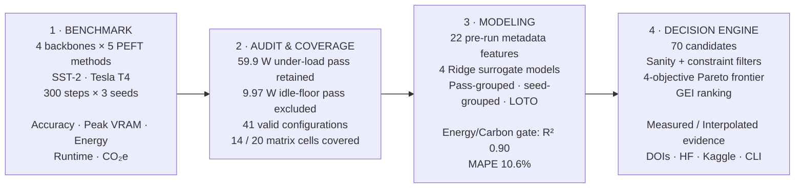

# GreenPEFT: A Multi-Objective Green AI Decision Support Framework

> **Sustainable Parameter-Efficient Fine-Tuning of Large Language Models via Predictive Zero-Shot Constraint Filtering and Green Efficiency Index (GEI)**


[](https://www.python.org/)
[](https://pytorch.org/)
[](https://codecarbon.io/)
[](https://pypi.org/project/green-peft/)
[](https://huggingface.co/ai-tanzil/GreenPEFT)

---

## 📌 Executive Summary

**GreenPEFT** shifts the paradigm of sustainable machine learning from static post-hoc benchmarking (*"Which method was most energy-efficient in past runs?"*) to **predictive, constraint-aware decision support** (*"Which PEFT configuration dynamically satisfies user VRAM, carbon, energy, and accuracy constraints while maximizing resource efficiency?"*).

Instead of requiring practitioners to run expensive empirical sweeps prior to selecting a fine-tuning strategy, GreenPEFT leverages a **zero-shot surrogate regressor** trained on pre-training metadata features (backbone parameters, adapter rank, quantization bits, dataset size) to forecast task performance and environmental cost. Combined with a multi-objective decision engine, Pareto-frontier filtering, and the **Green Efficiency Index (GEI)**, GreenPEFT prescribes the optimal adaptation strategy in sub-second inference time.

---

## 🔄 End-to-End Pipeline Overview

The GreenPEFT framework now follows the **four-stage research pipeline** used by the paper and the interactive dashboard:

1. **Benchmark** — run a fixed, reproducible PEFT benchmark and collect accuracy, memory, energy, runtime, and operational carbon measurements.
2. **Audit & Coverage** — remove invalid telemetry, retain the canonical energy pass, and document which backbone–method cells are covered.
3. **Modeling** — fit four Ridge surrogate models from pre-run metadata and validate them with grouped and leave-one-tier-out protocols.
4. **Decision Engine** — score the candidate zoo with physical constraints, a four-objective Pareto frontier, and Green Efficiency Index (GEI) ranking.


```mermaid
flowchart LR
    A["1 · BENCHMARK<br/>4 backbones × 5 PEFT methods<br/>SST-2 · Tesla T4<br/>300 steps × 3 seeds<br/><br/>Accuracy · Peak VRAM · Energy<br/>Runtime · CO₂e"] -->
    B["2 · AUDIT & COVERAGE<br/>59.9 W under-load pass retained<br/>9.97 W idle-floor pass excluded<br/>41 valid configurations<br/>14 / 20 matrix cells covered"] -->
    C["3 · MODELING<br/>22 pre-run metadata features<br/>4 Ridge surrogate models<br/>Pass-grouped · seed-grouped · LOTO<br/><br/>Energy/Carbon gate: R² 0.90<br/>MAPE 10.6%"] -->
    D["4 · DECISION ENGINE<br/>70 candidates<br/>Sanity + constraint filters<br/>4-objective Pareto frontier<br/>GEI ranking<br/><br/>Measured / Interpolated evidence<br/>DOIs · HF · Kaggle · CLI"]
```

### Stage Breakdown:
1. **Benchmark (`results/canonical_benchmark/`):** Evaluates Qwen2.5-0.5B, TinyLlama-1.1B, Qwen2.5-1.5B, and Qwen2.5-3B with Full-FT, LoRA, QLoRA, LoRA-FA, and LISA on SST-2 using an NVIDIA Tesla T4, 300 steps, and three seeds. Measurements include Accuracy, Peak VRAM, NVML Energy at 5 Hz, Runtime, and operational CO₂e derived as `Energy × 0.65 kg/kWh`.
2. **Audit & Coverage (`docs/AUDIT_REPORT.md`):** Retains the approximately 59.9 W under-load telemetry pass and excludes the approximately 9.97 W idle-floor pass caused by an instrumentation bug. The canonical dataset contains 41 valid configurations and covers 14 of 20 backbone–method cells.
3. **Modeling (`surrogate/validate.py`):** Uses 22 pre-run metadata features, including scale, bit width, adapter rank, memory bytes, and weight bytes, to fit four Ridge models for Accuracy, Memory/VRAM, Energy, and Runtime. Validation is pass-grouped, seed-grouped, and leave-one-tier-out (LOTO). Energy/Carbon is currently the validated gate (`R² = 0.90`, `MAPE = 10.6%`); other targets remain preliminary.
4. **Decision Engine (`green_peft/recommender.py`):** Scores 70 candidates through a sanity filter, a constraint filter with a 10% VRAM safety margin, accuracy/carbon/time limits, a four-objective Pareto frontier, and GEI ranking. Results label evidence as **Measured (High)** or **Interpolated / Out-of-bounds (Low)** and are exposed through the dashboard and `green-peft` CLI.

The CLI, Hugging Face bundle, Kaggle dataset, DOI records, and empirical recommendation validation are **outputs and interfaces of the four-stage pipeline**, not separate pipeline stages.

---

## 📑 Core Documentation & Repository Artifacts

| Category | File / Path | Description & Purpose |
| :--- | :--- | :--- |
| **Pipeline Reproduction** | [`reproduce.py`](reproduce.py) | Single command to verify and regenerate every derived artifact and test suite. |
| **Main Research Notebook** | [`notebooks/green-peft.ipynb`](notebooks/green-peft.ipynb) | End-to-end research notebook covering EDA, Pareto frontiers, and surrogate evaluations. |
| **Preprocessing Notebook** | [`notebooks/data_preprocessing_and_feature_engineering.ipynb`](notebooks/data_preprocessing_and_feature_engineering.ipynb) | Stages 1–8 feature pipeline generating the harmonized ML-ready dataset. |
| **Benchmark Notebook** | [`notebooks/green_peft_benchmark_execution.ipynb`](notebooks/green_peft_benchmark_execution.ipynb) | Kaggle T4 benchmark execution pipeline notebook. |
| **Surrogate Audit Report** | [`docs/AUDIT_REPORT.md`](docs/AUDIT_REPORT.md) | Audit analysis, GroupKFold / LOTO evaluation, and surrogate validation status. |
| **Implementation Report** | [`docs/IMPLEMENTATION_REPORT.md`](docs/IMPLEMENTATION_REPORT.md) | System completeness, audit envelope validation, and empirical scope breakdown. |
| **Reproduction Guide** | [`docs/PAPER_REPRODUCTION_GUIDE.md`](docs/PAPER_REPRODUCTION_GUIDE.md) | Paper reproduction guide and clean repository manifest. |
| **Data Provenance Guide** | [`docs/DATA_METHODOLOGY.md`](docs/DATA_METHODOLOGY.md) | Data sources, feature dictionary, and measurement pass filtering rules. |
| **Audited Model Metadata** | [`models/model_metadata.json`](models/model_metadata.json) | Machine-readable artifact metadata, training envelope, and error bounds. |
| **CLI Export Bundle** | [`models/artifacts_export/`](models/artifacts_export/) | Portable export bundle containing trained models and configurations for CLI offline use. |
| **Canonical Benchmark** | [`results/canonical_benchmark/`](results/canonical_benchmark/) | Verified raw JSON runs, aggregate metrics, and figures from the 60-run Kaggle T4 study. |
| **CLI Package** | [`green_peft_cli/green_peft_pkg/`](green_peft_cli/green_peft_pkg/) | Source code and test suite for the published `green-peft` PyPI package. |
| **Interactive Dashboard** | [`website/`](website/) | Web interface for constraint exploration and interactive recommendations. |

---

## 📊 Empirical Pilot Findings (NVIDIA Tesla T4)

Below are the empirical findings from the 60-run benchmark grid executed on Kaggle using an **NVIDIA Tesla T4 GPU (16 GB VRAM)** on the SST-2 classification task ($k=3$ random seeds):

| Strategy | Backbone | Params | Accuracy (mean ± std) | Wall-clock (s) | Peak VRAM (GB) | Energy (kWh) | Carbon ($\text{kgCO}_2\text{eq}$) | GEI Score |
| :--- | :--- | :---: | :---: | :---: | :---: | :---: | :---: | :---: |
| **full_ft** | Qwen2.5-Tiny | 0.5B | **0.9122 ± 0.0117** | 222.77 | 13.48 | 0.00382 | 0.00248 | 0.964 |
| **lisa** | Qwen2.5-Tiny | 0.5B | 0.5089 ± 0.0165 | **182.87** | **4.84** | **0.00324** | **0.00211** | **0.999** |
| **lisa** | TinyLlama-Small | 1.1B | 0.6122 ± 0.0901 | 467.91 | 9.43 | 0.00833 | 0.00541 | 0.822 |
| **lisa** | Qwen2.5-Medium | 1.5B | 0.4889 ± 0.0342 | 636.33 | 14.88 | 0.01124 | 0.00731 | 0.751 |

### Key Takeaways:
1. **Full-FT Memory Ceiling:** Full Fine-Tuning hits a hard VRAM ceiling at 0.5B parameters ($13.48$ GB peak VRAM). At $\ge 1.1\text{B}$, Full-FT immediately fails with Out-Of-Memory (OOM) errors.
2. **LISA Hardware Scaling:** LISA enables a 1.5B model to execute within a 16 GB VRAM budget ($14.88$ GB peak), where Full-FT fails completely.
3. **GEI Dominance:** LISA on 0.5B achieves the highest GEI score ($0.999$) due to its compact $4.84$ GB memory footprint and minimal carbon emissions.

---

## ⚖️ Green Efficiency Index (GEI) Formula

The **Green Efficiency Index (GEI)** synthesizes multi-dimensional objectives into a single decision score:

$$\text{GEI}(\mathbf{c}) = w_{\text{Acc}} \hat{S}_{\text{Acc}} + w_{\text{Mem}} \hat{S}_{\text{Mem}} + w_{C} \hat{S}_{C} + w_{T} \hat{S}_{T}$$

Where normalized metric scores are defined as:
$$\hat{S}_{\text{Acc}} = \frac{\text{Acc} - \text{Acc}_{\min}}{\text{Acc}_{\max} - \text{Acc}_{\min}}, \quad \hat{S}_{M} = 1 - \frac{M - M_{\min}}{M_{\max} - M_{\min}} \quad (M \in \{\text{Mem}, C, T\})$$

Weights satisfy $\sum w_i = 1$ based on user preference profiles:
- **Balanced Profile:** $w = [0.35, 0.25, 0.25, 0.15]$
- **Strict Carbon Profile:** $w = [0.20, 0.20, 0.50, 0.10]$
- **High-Accuracy Profile:** $w = [0.60, 0.15, 0.15, 0.10]$

---

## 📁 Clean Repository Structure

```text
.
├── README.md                           # Main documentation & pipeline overview
├── LICENSE                             # MIT License
├── CITATION.cff                        # Citation metadata
├── reproduce.py                        # Single command to reproduce all artifacts & tests
├── data/                               # Harmonized & raw datasets
│   ├── raw/                            # Source datasets (surrogate_dataset, LLM-Perf, etc.)
│   └── processed/                      # Harmonized 477x46 dataset & surrogate bundle (.joblib)
├── notebooks/                          # Categorized research & execution notebooks
│   ├── green-peft.ipynb                # Primary research & surrogate evaluation notebook
│   ├── green_peft_benchmark_execution.ipynb  # Kaggle T4 empirical benchmark execution notebook
│   ├── data_preprocessing_and_feature_engineering.ipynb # Feature pipeline (Stages 1–8)
│   └── legacy/                         # Historical audit notebooks
├── docs/                               # Comprehensive project documentation & reports
│   ├── AUDIT_REPORT.md                 # Surrogate audit & cross-validation metrics
│   ├── IMPLEMENTATION_REPORT.md        # System implementation & validation status
│   ├── PAPER_REPRODUCTION_GUIDE.md     # Step-by-step reproduction guide & file manifest
│   ├── DATA_METHODOLOGY.md             # Data harmonization rules & feature dictionary
│   ├── greenpeft_agent_workflow.md     # Agent specification & task roadmap
│   ├── progress_summary.md             # Development summary & milestones
│   ├── context.md                      # Strategic project context
│   └── author.md                       # Author profile & contact
├── analysis/                           # Reproduction & analysis pipeline scripts
│   ├── greenpeft_data.py               # Shared data loader & canonical filtering
│   ├── build_training_envelope.py      # Measured envelope builder for metadata
│   ├── benchmark_analysis.py           # Summary table generator
│   ├── pareto_analysis.py              # Pareto frontier extractor
│   ├── recommendation_scenarios.py     # Recommendation scenario builder (Table 4)
│   ├── figures.py                      # Publication figure generators
│   └── build_hf_export.py              # Model card & HF export package builder
├── surrogate/                          # Surrogate validation
│   └── validate.py                     # Grouped CV & extrapolation auditor
├── experiments/                        # Empirical validation & back-testing
│   ├── validate_recommendation.py      # Predicted vs actual empirical back-testing
│   └── recorded_run.template.json      # Template for logging new empirical runs
├── models/                             # Audited model metadata & CLI export bundle
│   ├── model_metadata.json             # Machine-readable model envelope & audit record
│   └── artifacts_export/               # Export bundle used by CLI recommender
├── green_peft_cli/                     # Installable green-peft CLI package
│   └── green_peft_pkg/                 # Package source, pyproject.toml & pytest suite
├── results/                            # Canonical & derived experimental outputs
│   ├── canonical_benchmark/            # Source-of-truth 60-run Kaggle T4 sweep
│   ├── benchmark/                      # Feasibility matrix & summary tables
│   ├── pareto/                         # Pareto frontiers & candidate sets
│   ├── recommendations/                # Decision scenario JSON/CSV outputs
│   ├── surrogate/                      # CV metrics & actual vs predicted figures
│   ├── hf_export/                      # Published HuggingFace artifact export
│   └── recommendation_validation.csv   # Predicted vs actual validation log
└── website/                            # Interactive Web UI dashboard
```

---

## 🚀 Quickstart & Installation

### 1. Installation

Install the published CLI package directly from PyPI:

```bash
pip install green-peft
```

Or install locally from source:

```bash
pip install -e green_peft_cli/green_peft_pkg
```

### 2. Run Constraint-Aware Recommendation CLI

Request a balanced recommendation under explicit resource constraints:

```bash
green-peft recommend --vram 16 --accuracy 0.90 --profile balanced
```

Request a strict carbon-constrained recommendation with JSON output:

```bash
green-peft recommend --vram 16 --carbon 0.003 --accuracy 0.90 --profile strict_carbon --json
```

List available candidate backbones and methods in the zoo:

```bash
green-peft list-zoo --artifacts-dir ./models/artifacts_export
```

### 3. Reproduce All Derived Artifacts

Run the single-command reproduction pipeline to verify all tables, figures, and unit tests:

```bash
python reproduce.py
```

Run in `--check` mode to verify recorded artifacts without mutating the workspace:

```bash
python reproduce.py --check
```

---

## 📜 Citation

If you use **GreenPEFT** in your research, please cite:

```bibtex
@misc{ashraful_islam_tanzil_2026,
    author       = {Ashraful Islam Tanzil},
    title        = {GreenPEFT: A Multi-Objective Green AI Decision Support Framework},
    year         = {2026},
    url          = {https://huggingface.co/ai-tanzil/GreenPEFT},
    doi          = {10.57967/hf/10504},
    publisher    = {Hugging Face}
}
```

---
*License: [MIT License](LICENSE)*
